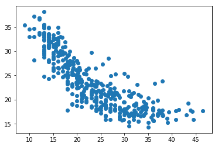

## Intermediate Stats functions
In this document I will write a bunch of functions that can solve a series of intermediate level stats problems.


```python
import numpy as np
vals = [8,9,3,5,4,6,0,2,1,7]
```


```python
## counts values in a list
def my_count(vals):
    count = 0
    for i in vals:
        count += 1
    return count
```


```python
my_count(vals)
```


    10


```python
## Solves the sqrt of a value
def my_sqrt(x):
    i = 0
    while (i*i) < x:
        i += 0.000001
    return round(i, 2)
```


```python
# my_sqrt(100000)
```


```python
## Sums values in a list
def my_sum(vals):
    sum = 0
    for x in vals:
        sum += x
    return sum
```


```python
## Calculates mean using the my_sum and my_count variables
def my_mean(vals):
    return my_sum(vals)/ my_count(vals)
```


```python
my_mean(vals)
```


    4.5


```python
## Solves the  absolute value of the input
def my_abs(val):
    if val < 0:
        return val * -1
    else:
        return val
```


```python
## Solves absolute values of a list
def my_listAbs(vals):
    newvals=[]
    for i in range(my_count(vals)):
        if vals[i] < 0:
            newvals.append(vals[i] * -1)
        else:
            newvals.append(vals[i])
    return newvals
        
```


```python
## Mean Absolute Deviation (MAD)
# How much each data point deviates from the mean
def MAD(vals):
    import numpy as np
    lsm = []
    for i in range(my_count(vals)):
        lsm.append(my_abs(vals[i] - my_mean(vals)))
    return my_sum(lsm)/len(lsm)
        
```


```python
MAD([11, 12, 5, 7, 5])
```


    2.8


```python
## Searches for minimum value in a list
def my_min(a):
    first = a[0]
    for i in range(my_count(a)):
        if a[i] < first:
            first = a[i]
    return first
```


```python
my_min(vals)
```


    0


```python
## searches for maximum values in a list
def my_max(a):
    first = 0
    for i in range(my_count(a)):
        if a[i] > first:
            first = a[i]
    return first
```


```python
my_max(vals)
```


    9


```python
## Sorts a list int ascending or descending order based on the user input
# uses the same logic as the my_max and my_min functions but doesn't include them in the function.
def my_sorter(vals, order = "ascending"): 
    temp = list(vals)
    sort = []
    
    if order == "ascending":
        while temp:
            minimum = temp[0]

            for x in temp:
                if x < minimum:
                    minimum = x
            sort.append(minimum)
            temp.remove(minimum)
    elif order == "descending":
        while temp:
            maximum = temp[0]

            for x in temp:
                if x > maximum:
                    maximum = x
            sort.append(maximum)
            temp.remove(maximum)
    return sort
    
```


```python
my_sorter(vals, "descending")
```


    [9, 8, 7, 6, 5, 4, 3, 2, 1, 0]


```python
## Returns the position in a listof a quartile provided by the user.
def my_quartile_position(vals, quartile):
    if quartile == None:
        return print("Please include what percentage of the quartile you desire then resubmit")
    else: 
        return (quartile)*(my_count(vals) + 1)
```


```python
my_quartile_position(vals, 0.75)
```


    8.25


```python
## Solves the variance of a list.
# Includes the degress of freedom so that the function can use Bessel's Correction
#  while solving for a sample.
# This functions includes the mean, sum, and count functions written above.

def my_variance(vals, ddof = 0):
    sum1 = my_sum(vals)
    mu = my_mean(vals)
    n = my_count(vals)-ddof
  
    newlist=[]
    for i in range(len(vals)):
        newlist.append((vals[i]-mu)**2)
    sumvar = my_sum(newlist)
    return sumvar/n
    
```


```python
my_variance(vals, ddof = 0)
```


    8.25


```python
## Implements the standard deviation using the variance equation above.
# Along with the square root function written above as well
def my_std(vals, ddof = 0):
    var = my_variance(vals, ddof)
    return(np.sqrt(var))
```


```python
my_std(vals, ddof = 0)
```


    2.8722813232690143


```python
## Solves for the z-score of a list.
def my_zScore(val, avg, std):
    z = (val - avg)/std
    if (z >= 1 or z <= -1):
        return round(z, 2)
    else: 
        return round(z, 4)
```


```python
lsi = [65, 83, 93, 100]
```


```python
lsi_std = my_std(lsi)
lsi_avg = my_mean(lsi)
for val in lsi:
    print("\t%s" % my_zScore(val, lsi_avg, lsi_std))
```

    	-1.54
    	-0.171
    	0.5889
    	1.12


```python
## To run these example you will need to read in the MPG data set
# https://gist.github.com/omarish/5687264
import pandas as pd
data = pd.read_csv("/Users/dylanedmonds/Documents/data/Data sets/csv files/mpg.csv")
data.keys()
```


    Index(['mpg', 'cylinders', 'displacement', 'horsepower', 'weight',
           'acceleration', 'model_year', 'origin', 'name'],
          dtype='object')


```python
mpg = list(data['mpg'])
weight =  list(data['weight'])
```


```python
## Implements least squares regression to create coefficients optimal for predicting 
# using simple linear regression.
# Gives the user the choice of return the intercept.

def my_leastSquares(X, y, intercept = True):
    mult = []
    for i in range(len(X)):
        mult.append(X[i]*y[i])
        
    sqr = []
    for i in X:
        sqr.append(i**2)
    
    b1 = my_sum(mult)/my_sum(sqr)
    if intercept:
        b0 = my_mean(y) - (b1 * my_mean(X))
        return b1, b0
    else:
        return b1
```


```python
b1, b0 = my_leastSquares(weight, mpg)
```


```python
## Use the coefficients from the my_leastSquares equation to make predictions
def my_prediction(X, b1, b0):
    pred = []
    for i in X:
        pred.append(b0 + (i * b1))
    return pred
```


```python
pred = my_prediction(weight, b1, b0)
```


```python
## Solves the residuals of the my_prediction function
def my_residuals(y_true, y_pred):
    r = []
    for i in range(len(y_true)):
        r.append(y_true[i] - y_pred[i])
    return r
```


```python
res = my_residuals(mpg, pred)
```


```python
## implements the MSE of the predictions
def my_MSE(y_true, y_pred):
    r = []
    n = my_count(y_true)
    for i in range(len(y_true)):
        r.append((y_true[i] - y_pred[i])**2)
    return my_sum(r)/n

## Takes the RMSE to return measure to original units
def my_RMSE(y_true, y_pred):
    r = []
    n = my_count(y_true)
    for i in range(len(y_true)):
        r.append((y_true[i] - y_pred[i])**2)
    mse = my_sum(r)/n
    return my_sqrt(mse)
    
```


```python
my_MSE(mpg, pred)
```


    167.59800818966823


```python
my_RMSE(mpg, pred)
```


    12.95


```python
import matplotlib.pyplot as plt
%matplotlib inline
plt.scatter(mpg, pred)
```


    <matplotlib.collections.PathCollection at 0x11c467898>





```python
std_x = my_std(weight); std_y = my_std(mpg)
mean_x = my_mean(weight); mean_y = my_mean(mpg)
```


```python
## Solves for the Coefficient of Determination.
# R squared compares the models variance with the total variance of the data
def my_r2(y, pred):
    mean = my_mean(y)
    sr = [] 
    for i in pred:
        sr.append((i-mean)**2)
    st = []
    for i in y: 
        st.append((i-mean)**2)
    ssr = my_sum(sr)
    sst = my_sum(st)
    r2 = 1 - (ssr/sst)
    return r2
```


```python
my_r2(mpg, pred)
```


    0.46562853992990205


